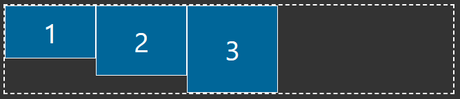
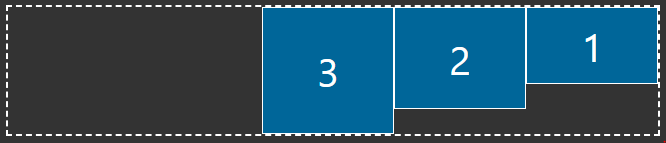
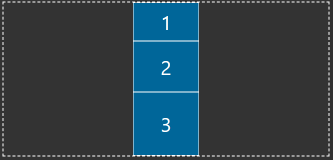
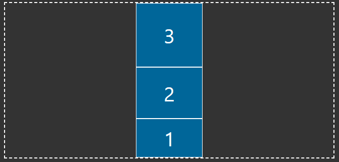
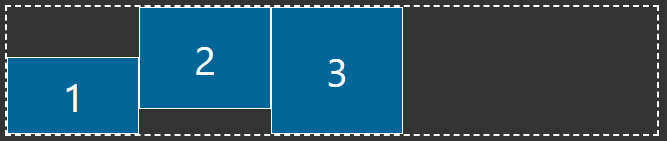
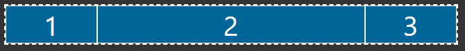
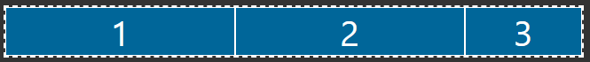
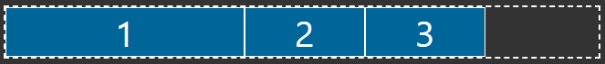
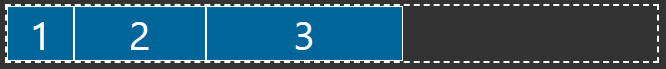
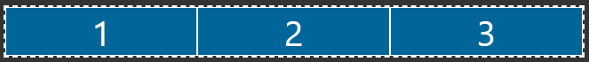

# Qu'est-ce que c'est les Flexbox ?

La Flexbox est une méthode de mise en page des éléments en CSS et se compose de deux éléments principaux.
Le conteneur flexbox et les éléments flexbox. Le conteneur flexbox est l'élément parent qui contient tous les éléments
flexbox en tant qu'enfants. C'est dans le conteneur flexbox que vous définissez toutes les propriétés de la disposition
flexbox, puis vous pouvez apporter des modifications supplémentaires aux éléments individuels. Voyons comment nous
pouvons commencer avec un exemple simple de flexbox. Si nous avons un élément avec des enfants à l'intérieur, tout ce
que nous devons faire est de définir la propriété display de l'élément parent sur `flex` et nous aurons un conteneur flex.
`display : flex`

[Example](0)

Résultat :


Comme vous pouvez le voir, par défaut, lorsque nous spécifions un affichage de flex sur un élément, nous définissons cet
élément comme le conteneur de flex. Tous les enfants directs de cet élément sont alors considérés comme des éléments
flex. Par défaut, si vous ne spécifiez pas d'autres propriétés, les éléments flex s'étendront sur une ligne de gauche à
droite et n'occuperont que l'espace dont ils ont besoin. Les éléments seront également automatiquement réduits pour
s'adapter au conteneur flexible s'ils débordent normalement.

Il s'agit là des bases absolues de la méthode flexbox et, à elle seule, elle n'est pas vraiment utile. Nous allons
maintenant aborder la manière de gérer la disposition des éléments dans le conteneur.

## Flexbox Layout

Flexbox est la première méthode de mise en page CSS qui fonctionne d'une manière complètement différente des CSS normaux.
Au lieu de se soucier des éléments en bloc ou en ligne, Flexbox se soucie d'un axe principal (Main axis) et d'un axe
transversal (Cross axis).


Par défaut, l'axe principal (affiché en rouge) traverse le conteneur horizontalement et l'axe transversal verticalement.
Cela signifie que toute méthode de mise en page traitant l'axe principal disposera les éléments horizontalement, tandis
que l'axe transversal disposera les éléments verticalement. Voyons d'abord comment disposer les éléments le long de
l'axe principal.

### `justify-content`

Vous pouvez retrouver un exemple du `justify-content` [ici](1).

Pour tous ces exemples, nous supposerons que les éléments flexibles ont une largeur de 20 %.

```css
.flex-item {
    width: 20%;
}
```

#### `flex-start` (default)

Place tous les éléments au début de l'axe principal, qui est le côté gauche de l'axe par défaut. C'est également le
comportement par défaut de `justify-content`.

```css
.flex-container {
    display: flex;
    justify-content: flex-start;
}
```


#### `flex-end`

Place tous les éléments à la fin de l'axe principal, qui est le côté droit de l'axe par défaut.

```css
.flex-container {
    display: flex;
    justify-content: flex-end;
}
```


#### `center`

Place tous les éléments au centre de l'axe principal. C'est l'une des façons les plus simples de centrer des éléments
en CSS.

```css
.flex-container {
    display: flex;
    justify-content: center;
}
```


#### `space-between`

Cela prend tout l'espace supplémentaire à l'intérieur du conteneur et le répartit uniformément entre chaque élément
pour les espacer le plus possible les uns des autres tout en remplissant le conteneur complet.

```css
.flex-container {
    display: flex;
    justify-content: space-between;
}
```


#### `space-around`

Cette fonction est très similaire à `space-between`, mais elle ajoute également un espace entre l'extérieur du conteneur
et le premier/dernier élément. La quantité d'espace entre l'extérieur du conteneur et le premier/dernier élément est
exactement la moitié de l'espace entre les éléments.

```css
.flex-container {
    display: flex;
    justify-content: space-around;
}
```


#### `space-evenly`

C'est très similaire à `space-around`, mais l'espace entre l'extérieur du conteneur et le premier/dernier élément est
le même que l'espace entre les éléments au lieu de la moitié de la taille.

```css
.flex-container {
    display: flex;
    justify-content: space-evenly;
}
```


### `align-items`

Vous pouvez retrouver un exemple du `justify-content` [ici](2).

Pour tous ces exemples, nous supposerons que les éléments flexibles ont tous une largeur de 20 %, mais que les éléments
ont tous des hauteurs différentes.

```css
.flex-item {
  width: 20%;
}

.flex-item:nth-child(1) {
  height: 75px;
}

.flex-item:nth-child(2) {
  height: 100px;
}

.flex-item:nth-child(3) {
  height: 125px;
}
```

#### `stretch` (default)

Cela aura pour effet d'étirer tous les éléments pour qu'ils occupent toute la hauteur de l'axe transversal, à moins
qu'une hauteur spécifique ne soit définie. Dans notre exemple, j'ai défini la hauteur du premier enfant sur `initial`,
ce qui revient à dire que nous n'avons pas défini de hauteur pour le premier enfant. Par défaut, lorsqu'une div n'a pas
de hauteur, celle-ci correspond à la hauteur du contenu qu'il contient, mais comme vous pouvez le voir ci-dessous,
le premier enfant remplit toute la hauteur du conteneur puisqu'il s'étire pour remplir toute la hauteur.
Le deuxième élément ne s'étire pas, cependant, parce que nous lui avons fixé une hauteur spécifique de 100px.
C'est le comportement par défaut de `align-items`.

```css
.flex-container {
  display: flex;
  align-items: stretch;
}

.flex-item:nth-child(1) {
  /* This is the same as if we had not set a height */
  height: initial;
}
```


#### `flex-start`

Cela fonctionne de la même manière que `flex-start` pour `justify-content`, mais commencera en haut de l'axe transversal
par défaut.

```css
.flex-container {
  display: flex;
  align-items: flex-start;
}
```


#### `flex-end`

Cela fonctionne de la même manière que `flex-end` pour `justify-content`, mais commencera en bas de l'axe transversal
par défaut.

```css
.flex-container {
  display: flex;
  align-items: flex-end;
}
```


#### `center`

Cela fonctionne de la même manière que `center` pour `justify-content`, mais le centrage sera basé sur l'axe transversal.

```css
.flex-container {
  display: flex;
  align-items: center;
}
```


Cela couvre toutes les façons dont vous pouvez disposer les éléments le long de l'axe principal et de l'axe transversal,
mais il y a encore une chose importante que vous devez savoir sur les axes flexbox. Ils peuvent en fait être intervertis.
Il existe une propriété appelée `flex-direction` qui détermine l'orientation de l'axe principal et de l'axe transversal.

## `flex-direction`

Vous pouvez retrouver un exemple du `flex-direction` [ici](3).

Cette propriété nous permet de déterminer à quelle direction correspond chaque axe ainsi que le point de départ des axes.

### `row` (default)

La direction par défaut est la ligne. Cela signifie que l'axe principal est horizontal et que l'axe transversal est
vertical. Cela signifie également que l'axe principal commence à gauche tandis que l'axe transversal commence en haut.

```css
.flex-container {
  display: flex;
  flex-direction: row;
  justify-content: flex-start;
  align-items: flex-start;
}
```



### `row-reverse`

Comme pour `row`, nous avons `row-reverse`. Cette direction n'intervertit pas l'axe principal et l'axe transversal, mais elle
intervertit le point de départ de l'axe principal. L'axe principal commence maintenant à droite, tandis que l'axe
transversal ne change pas et commence toujours en haut. Vous verrez ci-dessous que nos éléments commencent sur le côté
droit du conteneur et sont classés de droite à gauche puisque nous utilisons l'ordre inverse.

```css
.flex-container {
  display: flex;
  flex-direction: row-reverse;
  justify-content: flex-start;
  align-items: flex-start;
}
```



### `column`

La direction `column` intervertit complètement nos axes : l'axe principal est désormais vertical et l'axe transversal est
horizontal. Cela signifie que si vous utilisez JustifyContent, vous disposerez les éléments dans le sens vertical et
`align-items` fonctionnera dans le sens horizontal.

```css
.flex-container {
  display: flex;
  flex-direction: column;
  justify-content: flex-start;
  align-items: center;
}
```



### `column-reverse`

La direction `column-reverse` est essentiellement la même que `column`, mais elle inverse la direction de l'axe principal de
sorte que les éléments commencent maintenant au bas du conteneur.

```css
.flex-container {
  display: flex;
  flex-direction: column-reverse;
  justify-content: flex-start;
  align-items: center;
}
```



Nous venons d'aborder un grand nombre de sujets liés à la mise en page, mais les principaux éléments que vous devez
comprendre sont `justify-content`, `align-items`, `flex-direction`, et la manière dont chacun d'entre eux affecte
l'axe principal/croisé.

## Flex Item Layout

Vous pouvez retrouver un exemple du `align-self` [ici](4).

Jusqu'à présent, tout ce que nous avons abordé concernait la mise en page de l'ensemble du conteneur flexible. Nous
pouvons cependant aller plus loin et avoir des dispositions spécifiques pour chaque élément du conteneur flexible.
Cela se fait par le biais de la propriété `align-self`.

```css
.flex-container {
  display: flex;
  align-items: flex-start;
}

.flex-item:nth-child(1) {
  align-self: flex-end;
}
```



Comme vous pouvez le voir dans l'exemple ci-dessus, nous avons défini la propriété `align-self` du premier enfant sur
FlexEnd et il est maintenant aligné au bas de notre axe transversal, même si le conteneur flexible dans son ensemble a
un `align-items` de `flex-start`.

Cette propriété `align-self` peut être utilisée avec n'importe quelle valeur `align-items` pour placer chaque élément du
conteneur exactement là où vous le souhaitez.

Une chose importante à noter, cependant, est qu'il n'y a aucun moyen de faire `justify-self` puisque toute justification
est prise en charge par le parent uniquement.

### Dimensionnement des Items Flex

Nous arrivons maintenant à ce qui est probablement la partie la plus déroutante de Flexbox, à savoir le dimensionnement
des éléments individuels, mais je vous promets que je vais rendre cela aussi facile que possible à comprendre.

La véritable puissance de flexbox ne réside pas dans ses propriétés de mise en page (même si elles sont étonnantes),
mais dans sa capacité à redimensionner les éléments en fonction de la taille des autres éléments de votre page. Cela se
fait par le biais de trois propriétés différentes : `flex-grow`, `flex-shrink` et `flex-basis`. Je veux d'abord parler
de `flex-grow`, car c'est la propriété que vous utiliserez le plus souvent.

#### `flex-grow`

La propriété `flex-grow` est une propriété que vous définissez sur un élément flex et qui indique à l'élément la
quantité d'espace supplémentaire qu'il est autorisé à prendre pour remplir son conteneur. Par défaut, cette propriété
est définie sur 0, ce qui signifie que l'élément n'obtient pas d'espace supplémentaire. Examinons d'abord un conteneur
flexible dans lequel aucun des éléments n'a la propriété `flex-grow` définie.


Comme vous pouvez le constater, chaque élément n'occupe que sa largeur et le reste de l'espace du conteneur n'est pas
rempli. C'est le comportement par défaut de flexbox, mais si vous voulez qu'un ou plusieurs éléments remplissent
l'espace restant, vous devez utiliser `flex-grow`.

```css
.flex-item:nth-child(2) {
  flex-grow: 1;
}
```



En définissant un `flex-grow` de 1, nous indiquons au deuxième élément qu'il doit obtenir 1 partie de l'espace
supplémentaire et, comme aucun autre élément n'a de `flex-grow`, cette 1 partie de l'espace supplémentaire est la
totalité de l'espace supplémentaire.

```css
.flex-item:nth-child(1),
.flex-item:nth-child(2) {
  flex-grow: 1;
}
```



Dans cet exemple, nous avons réglé le premier et le deuxième élément sur un `flex-grow` de 1. Chacun de ces éléments
recevra donc 1 partie de l'espace restant. Pour déterminer combien d'espace cela représente, il suffit d'additionner
tous les numéros de `flex-grow` de chaque élément du conteneur (1 + 1 = 2), puis de diviser le `flex-grow` de chaque
élément par ce nombre. Puisque notre `flex-grow` pour chaque élément est de 1, chaque élément se verra ajouter la moitié
de l'espace restant.

Il est cependant possible de créer des agencements plus complexes en donnant à certains éléments plus ou moins d'espace
disponible.

```css
.flex-item:nth-child(1) {
  flex-grow: 2;
}

.flex-item:nth-child(2) {
  flex-grow: 1;
}
```

Dans cet exemple, nous disons que le premier élément devrait obtenir 2 parties de l'espace restant tandis que le
second élément n'en obtient qu'une partie. En faisant le calcul, nous verrons que le premier élément obtient 2/3 de
l'espace restant tandis que le second élément n'obtient qu'un tiers de l'espace restant.


À première vue, vous pouvez penser que ce code dit que le premier élément doit être deux fois plus grand que le second,
mais flex grow ne se soucie que de l'espace restant après que tous les éléments ont été ajoutés au conteneur.
Puisque par défaut nos 3 éléments occupent 60% de la taille du conteneur, l'espace restant à diviser entre les éléments
n'est que de 40% de la taille du conteneur. Nous pouvons cependant modifier la façon dont cet espace restant est calculé
en utilisant `flex-basis`.

#### `flex-basis`

La propriété `flex-basis` indique à notre conteneur flex l'espace que prend l'élément dans le conteneur. Par défaut,
elle est définie sur `auto`, ce qui signifie qu'elle utilise simplement la propriété `width` de l'élément pour la
calculer.

```css
.flex-item:nth-child(1) {
  flex-basis: 40%;
}
```



Dans le code ci-dessus, nous avons défini la `flex-basis` du premier élément à 40 %. Ainsi, au lieu d'occuper 20 % de la
largeur (ce que nous avons défini comme la largeur de l'élément), il occupera 40 % de la `width` du conteneur. Cela
signifie maintenant qu'il reste moins d'espace dans le conteneur à diviser avec `flex-grow`.

Cette propriété n'est vraiment utile que lorsque vous souhaitez modifier la largeur des éléments dans le conteneur flex
afin qu'ils fonctionnent mieux avec `flex-grow`. Par exemple, disons que vous souhaitez créer trois éléments de taille
égale dans votre conteneur, mais qu'ils ont tous une largeur initiale différente que vous ne pouvez pas modifier.



```css
.flex-item {
  flex-grow: 1;
}
```


Vous pouvez penser qu'en fixant `flex-grow` à 1, ils auront tous la même taille, mais comme ils commencent à des
largeurs différentes, ils finiront à des largeurs différentes puisque la quantité d'espace supplémentaire ajoutée aux
éléments est exactement la même pour chacun, indépendamment de leur taille.

Pour contourner ce problème, vous devez donner à tous les éléments la même `flex-basis` afin qu'ils commencent tous à
la même taille et croissent au même rythme. En général, vous utiliserez 0 pour la `flex-basis`, car cela garantit que
tous les éléments ont toujours la même taille, quelle que soit leur taille de départ.

```css
.flex-item {
  flex-grow: 1;
  flex-basis: 0;
}
```


La dernière propriété de dimensionnement dont nous devons parler est le `flex-shrink`, que nous avons déjà vu en action.

#### `flex-shrink`

Au début de cet article, j'ai mentionné que si les éléments flexibles d'un conteneur débordent du conteneur, ils seront
automatiquement rétrécis pour atteindre la taille correcte. C'est parce que par défaut, `flex-shrink` est défini à 1
sur tous les éléments flexibles.

```css
.flex-item {
  width: 50%;
}
```



Bien que chaque élément doive représenter 50 % de la taille du conteneur, il se rétrécit uniformément de sorte que
chaque élément ne représente que 33 % de la taille du conteneur. Si nous voulions empêcher l'un des enfants de rétrécir,
nous pourrions définir le paramètre `flex-shrink` à 0.

```css
.flex-item {
  width: 50%;
}

.flex-item:nth-child(1) {
  flex-shrink: 0;
}
```


Comme vous pouvez le constater, le premier élément conserve 50 % de la taille du conteneur et ne rétrécit pas, tandis
que les deux autres éléments rétrécissent pour que tous les éléments puissent entrer dans le conteneur.

Nous pouvons également faire en sorte que certains elements rétrécissent plus que d'autres.

```css
.flex-item {
  width: 50%;
}

.flex-item:nth-child(1) {
  flex-shrink: 2;
}
```


En définissant le paramètre `flex-shrink` à 2, nous disons que le premier élément doit perdre 2 parties de l'espace
débordant alors que les deux autres éléments ne perdent chacun qu'une partie puisqu'ils sont définis à un `flex-shrink`
de 1 par défaut. Cela fonctionne exactement de la même manière que `flex-grow` en ce qui concerne les proportions, mais
`flex-shrink` traite de l'espace débordant à l'extérieur du conteneur tandis que `flex-grow` traite de l'espace restant
à l'intérieur du conteneur.

Dans la plupart des cas, il ne s'agit pas d'une propriété avec laquelle vous aurez à composer, puisque vous ne vous
souciez généralement que de la croissance des objets et que le rétrécissement par défaut en cas de débordement est
généralement ce que vous voulez.

De plus, une chose importante à noter est que `flex-shrink` est assez intelligent et s'assurera que si vous avez un
très gros objet et un très petit objet, ils se rétréciront de manière que le gros objet se rétrécisse plus afin
que le petit objet ne se rétrécisse pas au point de disparaître.

C'est tout ce que vous devez savoir sur le dimensionnement des éléments flexibles, mais que se passe-t-il si vous voulez
vous assurer que les éléments ne rétrécissent pas et qu'ils peuvent s'enrouler sur une nouvelle ligne si nécessaire.

## Flex Wrapping

Lorsque vous travaillez en flexbox, vous travaillez généralement avec une seule ligne d'éléments, mais il arrive
parfois, en de rares occasions, que vous souhaitiez gérer l'habillage lorsque vous avez plus d'éléments que ce que vous
pouvez faire tenir sur une ligne.

```css
.flex-container {
  flex-wrap: wrap;
}

.flex-item {
  width: 50%;
}
```


### Advanced Wrapping Layout

## Advanced Flexbox Properties

### Adding Gaps

### Ordering Elements

### Flex Shorthand

## Conclusion
