# Qu'est-ce que c'est les Flexbox ?

La Flexbox est une méthode de mise en page des éléments en CSS et se compose de deux éléments principaux.
Le conteneur flexbox et les éléments flexbox. Le conteneur flexbox est l'élément parent qui contient tous les éléments
flexbox en tant qu'enfants. C'est dans le conteneur flexbox que vous définissez toutes les propriétés de la disposition
flexbox, puis vous pouvez apporter des modifications supplémentaires aux éléments individuels. Voyons comment nous
pouvons commencer avec un exemple simple de flexbox. Si nous avons un élément avec des enfants à l'intérieur, tout ce
que nous devons faire est de définir la propriété display de l'élément parent sur `flex` et nous aurons un conteneur flex.
`display : flex`

[Example](0)

Resultat :
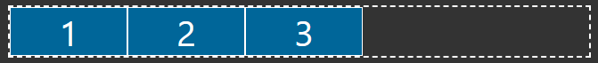

Comme vous pouvez le voir, par défaut, lorsque nous spécifions un affichage de flex sur un élément, nous définissons cet
élément comme le conteneur de flex. Tous les enfants directs de cet élément sont alors considérés comme des éléments
flex. Par défaut, si vous ne spécifiez pas d'autres propriétés, les éléments flex s'étendront sur une ligne de gauche à
droite et n'occuperont que l'espace dont ils ont besoin. Les éléments seront également automatiquement réduits pour
s'adapter au conteneur flexible s'ils débordent normalement.

Il s'agit là des bases absolues de la méthode flexbox et, à elle seule, elle n'est pas vraiment utile. Nous allons
maintenant aborder la manière de gérer la disposition des éléments dans le conteneur.

## Flexbox Layout

Flexbox est la première méthode de mise en page CSS qui fonctionne d'une manière complètement différente des CSS normaux.
Au lieu de se soucier des éléments en bloc ou en ligne, Flexbox se soucie d'un axe principal (Main axis) et d'un axe
transversal (Cross axis).

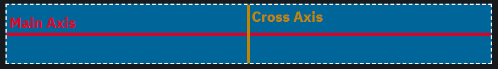

Par défaut, l'axe principal (affiché en rouge) traverse le conteneur horizontalement et l'axe transversal verticalement.
Cela signifie que toute méthode de mise en page traitant l'axe principal disposera les éléments horizontalement, tandis
que l'axe transversal disposera les éléments verticalement. Voyons d'abord comment disposer les éléments le long de
l'axe principal.

### `justify-content`

Vous pouvez retrouver un exemple du `justify-content` [ici](1).

Pour tous ces exemples, nous supposerons que les éléments flexibles ont une largeur de 20 %.

```css
.flex-item {
    width: 20%;
}
```

#### `flex-start` (default)

Place tous les éléments au début de l'axe principal, qui est le côté gauche de l'axe par défaut. C'est également le
comportement par défaut de `justify-content`.

```css
.flex-container {
    display: flex;
    justify-content: flex-start;
}
```
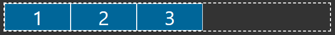

#### `flex-end`

Place tous les éléments à la fin de l'axe principal, qui est le côté droit de l'axe par défaut.

```css
.flex-container {
    display: flex;
    justify-content: flex-end;
}
```
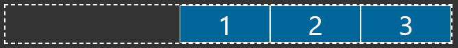

#### `center`

Place tous les éléments au centre de l'axe principal. C'est l'une des façons les plus simples de centrer des éléments
en CSS.

```css
.flex-container {
    display: flex;
    justify-content: center;
}
```
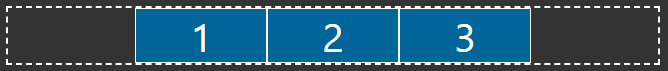

#### `space-between`

Cela prend tout l'espace supplémentaire à l'intérieur du conteneur et le répartit uniformément entre chaque élément
pour les espacer le plus possible les uns des autres tout en remplissant le conteneur complet.

```css
.flex-container {
    display: flex;
    justify-content: space-between;
}
```


#### `space-around`

Cette fonction est très similaire à `space-between`, mais elle ajoute également un espace entre l'extérieur du conteneur
et le premier/dernier élément. La quantité d'espace entre l'extérieur du conteneur et le premier/dernier élément est
exactement la moitié de l'espace entre les éléments.

```css
.flex-container {
    display: flex;
    justify-content: space-around;
}
```
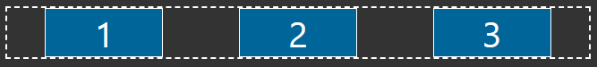

#### `space-evenly`

C'est très similaire à `space-around`, mais l'espace entre l'extérieur du conteneur et le premier/dernier élément est
le même que l'espace entre les éléments au lieu de la moitié de la taille.

```css
.flex-container {
    display: flex;
    justify-content: space-evenly;
}
```
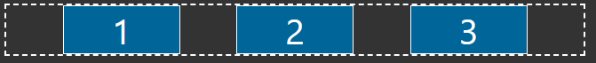

### `align-items`

Vous pouvez retrouver un exemple du `justify-content` [ici](2).

Pour tous ces exemples, nous supposerons que les éléments flexibles ont tous une largeur de 20 %, mais que les éléments
ont tous des hauteurs différentes.

```css
.flex-item {
  width: 20%;
}

.flex-item:nth-child(1) {
  height: 75px;
}

.flex-item:nth-child(2) {
  height: 100px;
}

.flex-item:nth-child(3) {
  height: 125px;
}
```

#### `stretch` (default)

Cela aura pour effet d'étirer tous les éléments pour qu'ils occupent toute la hauteur de l'axe transversal, à moins
qu'une hauteur spécifique ne soit définie. Dans notre exemple, j'ai défini la hauteur du premier enfant sur `initial`,
ce qui revient à dire que nous n'avons pas défini de hauteur pour le premier enfant. Par défaut, lorsqu'une div n'a pas
de hauteur, celle-ci correspond à la hauteur du contenu qu'il contient, mais comme vous pouvez le voir ci-dessous,
le premier enfant remplit toute la hauteur du conteneur puisqu'il s'étire pour remplir toute la hauteur.
Le deuxième élément ne s'étire pas, cependant, parce que nous lui avons fixé une hauteur spécifique de 100px.
C'est le comportement par défaut de `align-items`.

```css
.flex-container {
  display: flex;
  align-items: stretch;
}

.flex-item:nth-child(1) {
  /* This is the same as if we had not set a height */
  height: initial;
}
```

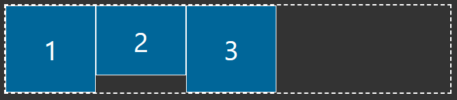

#### `flex-start`

Cela fonctionne de la même manière que `flex-start` pour `justify-content`, mais commencera en haut de l'axe transversal
par défaut.

```css
.flex-container {
  display: flex;
  align-items: flex-start;
}
```

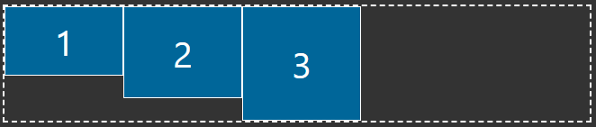

#### `flex-end`

Cela fonctionne de la même manière que `flex-end` pour `justify-content`, mais commencera en bas de l'axe transversal
par défaut.

```css
.flex-container {
  display: flex;
  align-items: flex-end;
}
```

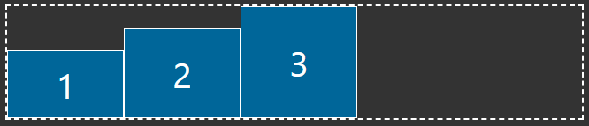

#### `center`

Cela fonctionne de la même manière que `center` pour `justify-content`, mais le centrage sera basé sur l'axe transversal.

```css
.flex-container {
  display: flex;
  align-items: center;
}
```

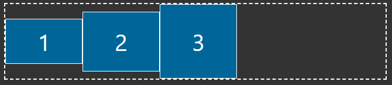

Cela couvre toutes les façons dont vous pouvez disposer les éléments le long de l'axe principal et de l'axe transversal,
mais il y a encore une chose importante que vous devez savoir sur les axes flexbox. Ils peuvent en fait être intervertis.
Il existe une propriété appelée `flex-direction` qui détermine l'orientation de l'axe principal et de l'axe transversal.

## `flex-direction`

Cette propriété nous permet de déterminer à quelle direction correspond chaque axe ainsi que le point de départ des axes.

### `row` (default)

La direction par défaut est la ligne. Cela signifie que l'axe principal est horizontal et que l'axe transversal est
vertical. Cela signifie également que l'axe principal commence à gauche tandis que l'axe transversal commence en haut.

### `row-reverse`

### `column`

### `column-reverse`

## Flex Item Layout

## Sizing Flex Items

### `flex-grow`

### `flex-basis`

### `flex-shrink`

## Flex Wrapping

### Advanced Wrapping Layout

## Advanced Flexbox Properties

### Adding Gaps

### Ordering Elements

### Flex Shorthand

## Conclusion
